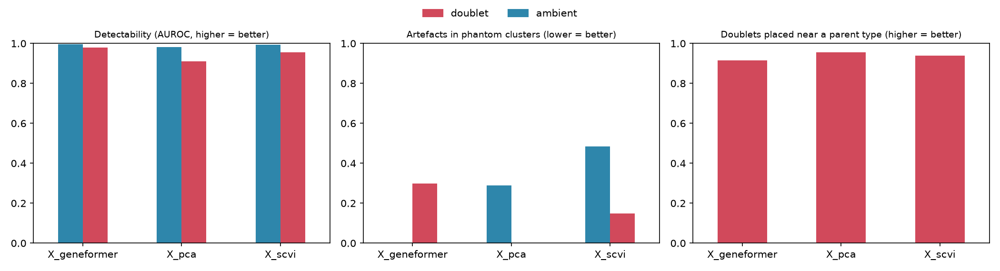
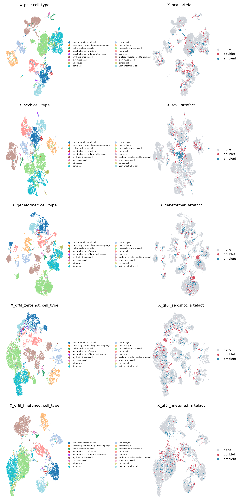

# scfm-validity

**Do single-cell foundation model embeddings capture biology, or artefacts?**

[](https://github.com/mircomacchi/scfm-validity/actions/workflows/ci.yml)

Doublets and ambient RNA are the two artefacts that most often become a "new cell type" in
scRNA-seq. This package injects both, with known labels, into a real dataset, embeds the cells
three ways and measures whether each embedding keeps the artefacts apart from real biology or
turns them into a convincing population.

| Embedding | What it is |
|---|---|
| PCA | log-normalised counts, 2,000 highly variable genes, 50 components (baseline) |
| scVI | variational autoencoder trained here on raw counts, batch-conditioned, 30 latent dimensions |
| Geneformer | `gf-12L-38M-i4096`, zero-shot through [helical](https://github.com/helicalAI/helical), 512 dimensions |

## Result on human skeletal muscle

Data: the CZ CELLxGENE skeletal muscle atlas (Eraslan et al., *Cell* 2023,
doi:10.1016/j.cell.2023.11.026). 20,184 dissociated cells from three studies (droplet assays
only), subsampled with every cell type kept, plus 1,009 simulated heterotypic doublets and 1,009
cells with 30% ambient contamination.



| Embedding | Artefact | Detectability (AUROC) | Artefacts in phantom clusters | Doublets near a parent type |
|---|---|---|---|---|
| PCA | doublet | 0.910 | **0.0%** | 95.5% |
| PCA | ambient | 0.982 | 28.8% | |
| scVI | doublet | 0.955 | 15.0% | 93.9% |
| scVI | ambient | 0.994 | 48.5% | |
| Geneformer | doublet | 0.979 | 29.9% | 91.5% |
| Geneformer | ambient | 0.995 | **0.0%** | |

**What it shows.**

1. **Every embedding makes artefacts detectable** (AUROC 0.91 to 0.995). A linear classifier can
   find them, so the information is there.
2. **Whether they become a fake population depends on the model and the artefact.** In the
   Geneformer embedding, Leiden clustering produces one cluster of 434 cells, 70% of them
   simulated doublets, mostly **fibroblast + satellite cell** pairs. An analyst without the labels
   would read it as a hybrid fibro-myogenic population. PCA puts no doublets in an
   artefact-dominated cluster. scVI and PCA both build an ambient-RNA cluster (92% artefact) out of
   mesenchymal stem cell and satellite cell profiles; Geneformer does not.
3. **Zero-shot Geneformer does not beat PCA on standard integration metrics** (scib total 0.524 vs
   0.538), while scVI, which models batch explicitly, scores highest (0.598, from better batch
   correction).

| Embedding | Bio conservation | Batch correction | scib total |
|---|---|---|---|
| PCA | 0.670 | 0.339 | 0.538 |
| scVI | 0.659 | 0.507 | 0.598 |
| Geneformer | 0.656 | 0.326 | 0.524 |



**Limits.** One dataset, one seed, one clustering resolution (Leiden 1.0, "phantom" = at least 50%
artefact). The artefacts are simulated: doublets are summed counts thinned to 1.6x singlet depth;
ambient contamination uses the pooled profile of each batch, since empty droplets are not
available. Geneformer is used zero-shot; fine-tuning could change the picture. Treat the numbers
as a case study, not a benchmark.

## Fine-tuning: better classifier, more phantom doublets

`gf-6L-10M-i2048` (the original 6-layer Geneformer) fine-tuned for cell-type classification, first 4
of 6 layers frozen, 3 epochs, CPU. **Split by study:** trained on 5,108 cells from Micheli et al. and
Tabula Sapiens, scored on 2,171 cells of He et al. 2020, a study the model never saw. The baseline is
a logistic regression on the zero-shot embedding of the same model.

| Held-out study (7 classes present) | Accuracy | Macro-F1 | Macro-F1 without MSC |
|---|---|---|---|
| Zero-shot + linear probe | 0.801 | 0.800 | 0.928 |
| Fine-tuned | **0.978** | **0.968** | **0.965** |

**Most of the gap is a naming convention, not biology.** Micheli et al. label the muscle stromal cells
"fibroblast"; Tabula Sapiens and He et al. label them "mesenchymal stem cell" (MSC). In muscle these
are most likely the same fibro-adipogenic progenitors. The probe maps He's MSCs to fibroblast and
adipocyte (F1 0.03); the fine-tuned model learned the Tabula Sapiens convention (F1 0.99). Without
that class, fine-tuning still helps (0.965 vs 0.928), mostly on vein endothelial cells (F1 0.91 vs
0.72). Per-class scores: `results/finetune_per_class.csv`.

| 6L embedding | Artefact | Phantom clusters | Artefacts in phantom clusters | Detectability (AUROC) | kNN enrichment |
|---|---|---|---|---|---|
| zero-shot | doublet | 1 (137 cells, 69% doublets) | 9.3% | 0.951 | 8.8 |
| fine-tuned | doublet | 2 (268 and 99 cells) | **23.4%** | 0.949 | 7.4 |
| zero-shot | ambient | 0 | 0.0% | 0.964 | 7.3 |
| fine-tuned | ambient | 0 | 0.0% | **0.914** | **3.9** |

**Fine-tuning on cell types made doublets look more like cell types.** The fine-tuned embedding forms
two doublet-dominated clusters, stromal + endothelial and stromal + immune pairs, against one before.
A classifier trained to separate labelled types sharpens the space, and heterotypic doublets become
compact groups of their own.

**It also made ambient-contaminated cells harder to find.** Neither 6L embedding builds an ambient
cluster, but after fine-tuning the contaminated cells are less detectable (AUROC 0.964 to 0.914) and
sit less often next to each other (kNN enrichment 7.3 to 3.9): the model places them with their own
cell type, which helps classification and hides the contamination. Fine-tuning improved the
classifier without making the embedding more robust to either artefact.

The scib scores of the fine-tuned embedding (total 0.597) are not comparable with the other
embeddings: bio conservation uses the same cell-type labels the model was trained on.

Reproduce: `bash hpc/finetune_local.sh data/prepared.h5ad` (about 2 hours 15 minutes on an M4 CPU; a 64-cell fine-tuning benchmark peaked at 3.7 GB and the scib evaluation at 13.8 GB; the full run was not profiled).

## Metrics

| Metric | Question | Better |
|---|---|---|
| `detectability_auroc` | Can a 5-fold cross-validated logistic regression tell artefacts from real cells in the embedding? | higher |
| `knn_enrichment` | How much more often do artefacts neighbour other artefacts than their prevalence predicts? | context |
| `phantom_fraction` | Share of artefact cells in Leiden clusters that are at least 50% artefact | lower |
| `parent_consistency` | Share of doublets whose majority real-cell neighbours are one of their two parent types | higher |

Plus the scib-metrics benchmark (bio conservation and batch correction) on the real cells.

## Use

```bash
pip install -e ".[scvi,fm,dev]"     # Python 3.11 or 3.12

scfm-validity prepare atlas.h5ad data/prepared.h5ad --n-cells 20000 --batch-key Dataset \
  --obs-filter '{"suspension_type": ["cell"]}'
scfm-validity embed data/prepared.h5ad --methods pca,scvi
bash hpc/geneformer_local.sh data/prepared.h5ad          # or hpc/geneformer_iris.sbatch on a GPU cluster
scfm-validity evaluate data/prepared.h5ad results/
```

Outputs: `results/artefact_metrics.parquet`, `results/scib_metrics.parquet` and the two figures.

## HTTP API

```bash
pip install -e ".[api,scvi]"
scfm-validity serve --port 8000            # interactive docs at http://localhost:8000/docs

curl -F file=@cells.h5ad -F methods=pca,scvi -F batch_key=donor_id localhost:8000/jobs
# {"job_id": "2f49...", "status": "queued"}
curl localhost:8000/jobs/2f49...
# {"status": "done", "result": [{"embedding": "X_pca", "artefact": "doublet", ...}, ...]}
```

`POST /jobs` streams the upload to disk (2 GB cap), validates the parameters and returns `202` at
once; one worker thread runs the job so a large upload cannot exhaust memory, and a failed job
reports its error instead of crashing the server. PCA and scVI only: Geneformer needs the batch
path. The job store is in memory, so a multi-replica deployment would swap it for a queue and a
database. In Docker: `docker run -p 8000:8000 scfm-validity serve --host 0.0.0.0`.

## Engineering notes

- **Tests.** `pytest` runs on a synthetic 600-cell dataset, including an end-to-end CLI run and
  the API (job lifecycle, validation, failure reporting), so CI needs no download. GitHub Actions runs ruff and pytest on Python 3.11 and 3.12, then builds the
  Docker image.
- **Memory on a 16 GB laptop.** Geneformer on Apple MPS thrashed memory: 200 cells took 1,325 s with
  an 18.5 GB footprint, against 235 s and 6.0 GB on CPU. Memory also grew across chunks within one
  process (40 GB after 11 chunks), so `hpc/geneformer_local.sh` embeds one 1,000-cell chunk per
  process, checkpoints each chunk and resumes where it stopped. Geneformer reads only the counts
  and writes its embedding straight into the h5ad. Chunks 1 to 11 of this run were computed on MPS
  and 12 to 23 on CPU with the same weights.
- **helical 3.1.3 workaround.** Its gene-collapsing step drops `var["ensembl_id"]` and then fails;
  `embed.py` deduplicates in-vocabulary genes and turns collapsing off.

## Author

Mirco Macchi, computational biologist (PhD, LCSB, University of Luxembourg).
Built with AI pair programming (Claude Code).
MIT licence.
